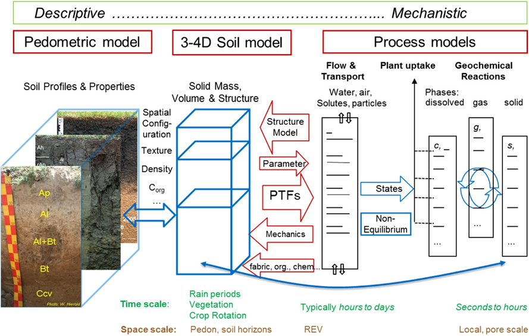

```{r setup, include=FALSE}
knitr::opts_chunk$set(echo = FALSE)
```

**Soil model as explained by Gerke et al. (2022)**
{width=100%}

My research focus is on using the above soil conceptual model to understand the fate and transport processes of water, nutrients, and pesticides for best management practices.
