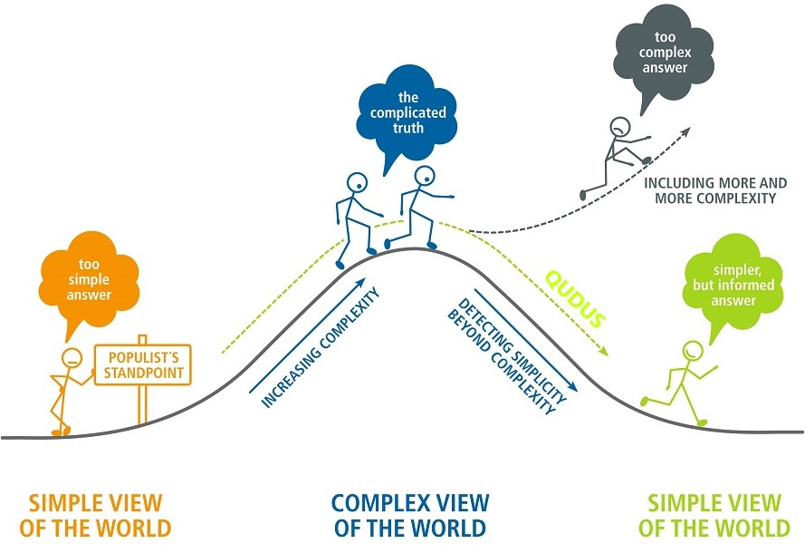

```{r setup, include=FALSE}
knitr::opts_chunk$set(echo = FALSE)
```

**Philosophy**
{width=100%}

Professionally, I am a graduate assistant at [Department of Soil, Water, and Ecosystem Sciences, UF](https://soils.ifas.ufl.edu/). I am interested in water, nutrients, and pesticides management.
