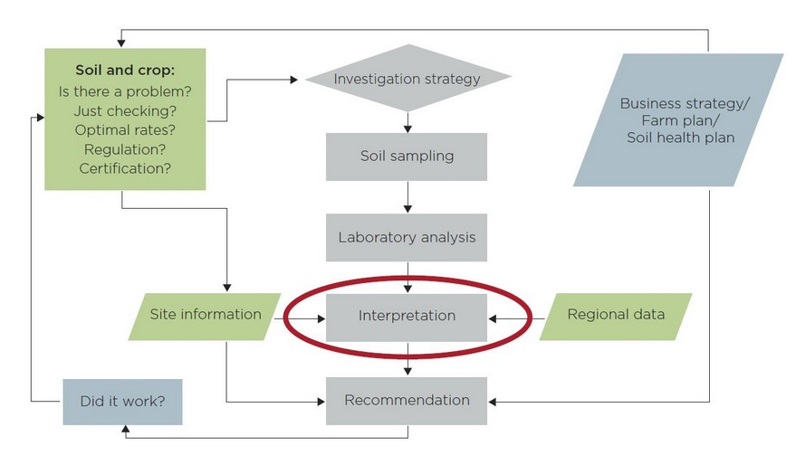

```{r setup, include=FALSE}
knitr::opts_chunk$set(echo = FALSE)
```

**The soil testing and nutrient management process - BFDC**
{width=100%}

Fertilizer recommendation support tool - A similar concept of making better fertilizer decisions for cropping systems in Australia (BFDC)
